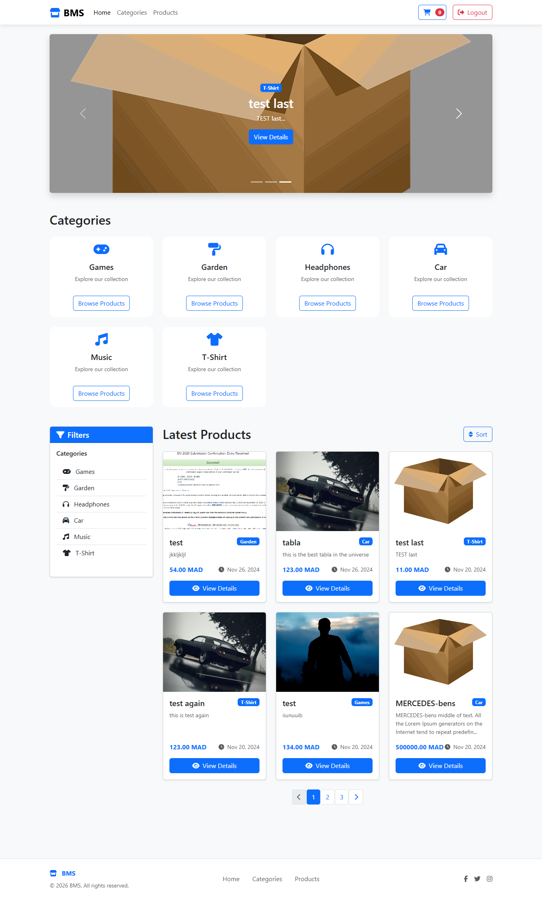
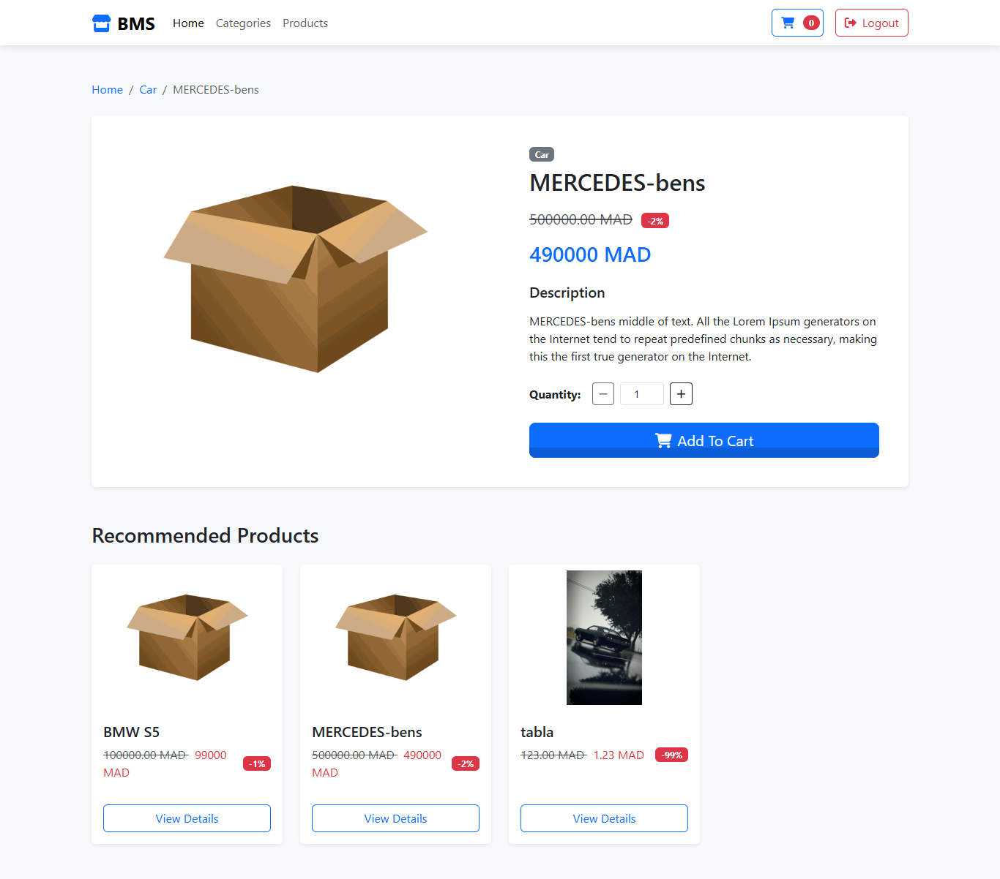
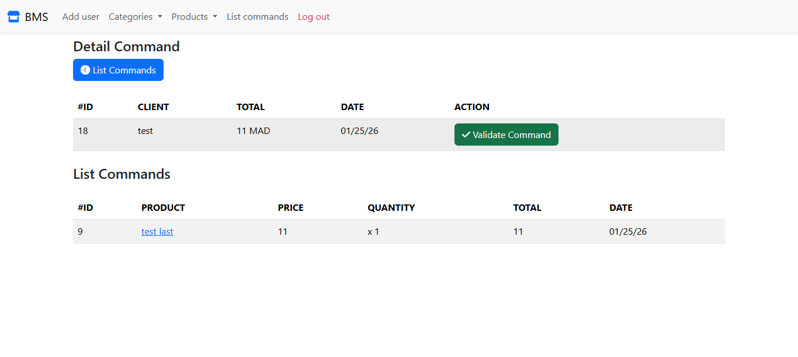

# 🛒 Pure PHP E-Commerce Website

## 📌 Project Overview
This project is a **full-featured e-commerce website** built using **pure PHP** with no frameworks.  
It includes a **dashboard for administrators**, allowing them to manage products, categories, and orders.  

Customers can browse products, add them to a **shopping cart**, and proceed to checkout.  
The project demonstrates core PHP development skills and understanding of MVC-like organization.

---

## 🧩 Features

### 🛍 Customer Features
- Browse products by category
- Add/remove items from shopping cart
- Checkout system (orders stored in database)
- Product details page

### 🛠 Admin Dashboard
- CRUD operations on products and categories
- Manage customer orders
- View order history and order details

### 💾 Database
- MySQL database storing products, categories, customers, and orders
- Secure handling of user inputs (basic sanitization)

---

## 🧰 Tech Stack
- **Language:** PHP 7/8
- **Database:** MySQL
- **Frontend:** HTML, CSS, JavaScript
- **Optional:** Bootstrap for styling

---

## 📷 Screenshots

### Homepage


### Product Details


### Add To Card


### Admin Dashboard


### List Categories


### List Produts


### List Commands


### Detail List Commands


---

## ⚙️ Installation & Usage

1. Clone the repository:  
```bash
git clone https://github.com/your-username/php-ecommerce.git
